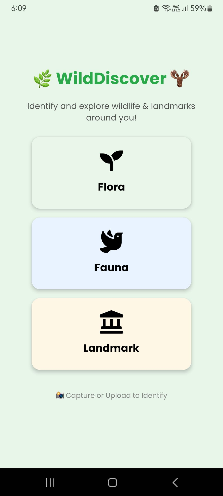

# 🌿 WildDiscover 🫎

WildDiscover is a React Native application designed to help users identify flora, fauna, and landmarks using advanced image recognition APIs and machine learning models. Whether you're exploring nature or visiting famous landmarks, WildDiscover provides detailed information about the objects you capture or upload.

---

## 📜 Features

- **Flora Identification**: Identify plants and get details like scientific name, family, habitat, and uses.
- **Fauna Identification**: Recognize animals, birds, and insects with information about their diet, habitat, and conservation status.
- **Landmark Identification**: Discover famous landmarks and learn about their history, architecture, and significance.
- **Wikipedia Integration**: Provides links and summaries from Wikipedia for additional information.
- **User-Friendly Interface**: Intuitive design for easy navigation and interaction.

---

## 🛠 Installation

Follow these steps to set up and run the project locally:

### Prerequisites

1. **Node.js**: Install [Node.js](https://nodejs.org/) (LTS version recommended).
2. **Expo CLI**: Install Expo CLI globally using:

   ```bash
   npm install -g expo-cli
   ```

3. **Android/iOS Emulator or Physical Device**: Ensure you have an emulator set up or a physical device with the Expo Go app installed.

### Steps

1. **Clone the Repository**:

   ```bash
   git clone <repository-url>
   cd WildDiscover
   ```

2. **Install Dependencies**:
   Run the following command to install all required dependencies:

   ```bash
   npm install
   ```

3. **Set Up API Keys**:
   Create a `config/config.js` file and add your API keys:

   ```javascript
   export const GOOGLE_VISION_API_KEY = 'your-google-vision-api-key';
   export const PLANT_NET_API_KEY = 'your-plant-net-api-key';
   export const ANIMAL_API_KEY = 'your-animal-api-key';
   ```

4. **Run the Project**:
   Start the development server using:

   ```bash
   npx expo start
   ```

   - Use the Expo Go app to scan the QR code and run the app on your device.
   - Alternatively, use an emulator for Android or iOS.

---

## 📂 Project Structure

```plaintext
WildDiscover/
├── api/                   # API integration files
├── components/            # Reusable UI components
├── screens/               # App screens (Home, Flora, Fauna, Landmark, Result)
├── assets/                # Static assets (icons, images)
├── config/                # Configuration files (ignored in .gitignore)
├── .vscode/               # VS Code settings (ignored in .gitignore)
├── App.js                 # Main app entry point
├── app.json               # Expo configuration
├── package.json           # Project dependencies and scripts
├── README.md              # Project documentation
└── index.js               # Entry point for the app
```

---

## 📦 Required Libraries

The following libraries are required for the project. These will be installed automatically when you run `npm install`.

### Core Dependencies

- `react`: Core React library.
- `react-native`: Core React Native library.
- `expo`: Framework for building React Native apps.
- `expo-image-picker`: For selecting or capturing images.
- `expo-file-system`: For file system operations.
- `expo-font`: For custom fonts.
- `expo-status-bar`: For managing the status bar.
- `@react-navigation/native`: For navigation.
- `@react-navigation/stack`: For stack-based navigation.
- `axios`: For making HTTP requests.
- `@expo-google-fonts/poppins`: For custom fonts.
- `react-native-vector-icons`: For icons.

### Development Dependencies

- `jest`: For testing.
- `axios-mock-adapter`: For mocking Axios requests during testing.

If any library is missing, you can install it manually using:

```bash
npm install <library-name>
```

---

## 🚀 Usage

1. **Home Screen**:
   - Choose a category: Flora, Fauna, or Landmark.
2. **Capture or Upload an Image**:
   - Use your camera or select an image from your gallery.
3. **Analyze the Image**:
   - The app will identify the object and display detailed information.
4. **Explore Further**:
   - Click the Wikipedia link for more details.

---

## 📸 Screenshots

### Home Screen


### Flora Identification


### Fauna Identification


### Landmark Identification


---

## 🧰 Technologies Used

- **React Native**: Cross-platform mobile app development.
- **Expo**: Simplified development and deployment.
- **APIs**:
  - Google Vision API
  - PlantNet API
  - API Ninjas Animal API
  - Pollinations.ai
  - Wikipedia API
- **Axios**: For making HTTP requests.

---

## 📝 License

This project is licensed under the **MIT License**. See the [LICENSE](LICENSE) file for details.

---

## 🤝 Contributing

Contributions are welcome! If you'd like to contribute, please fork the repository and submit a pull request.

---
